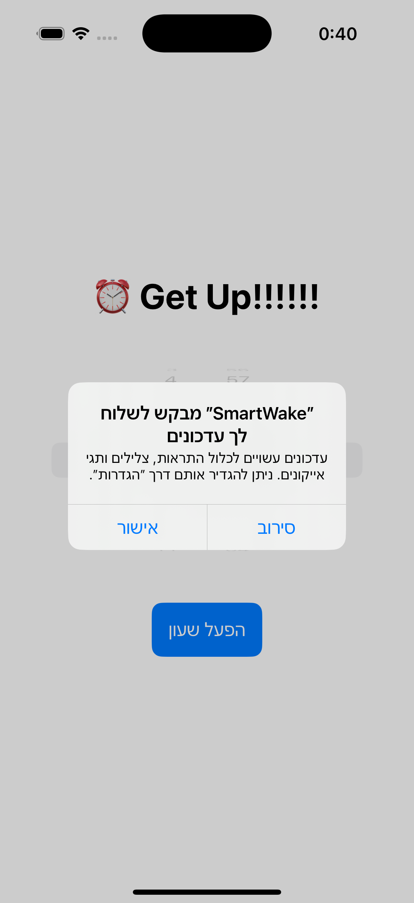
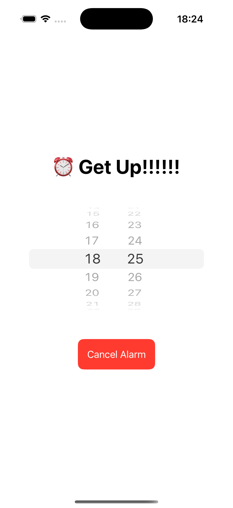
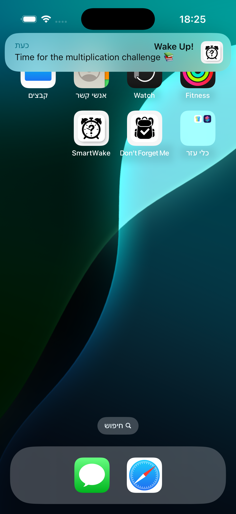
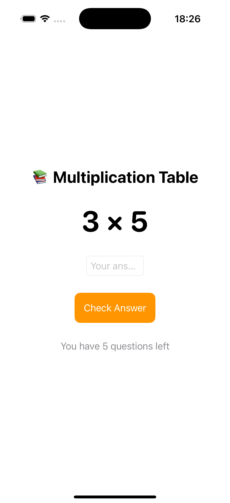
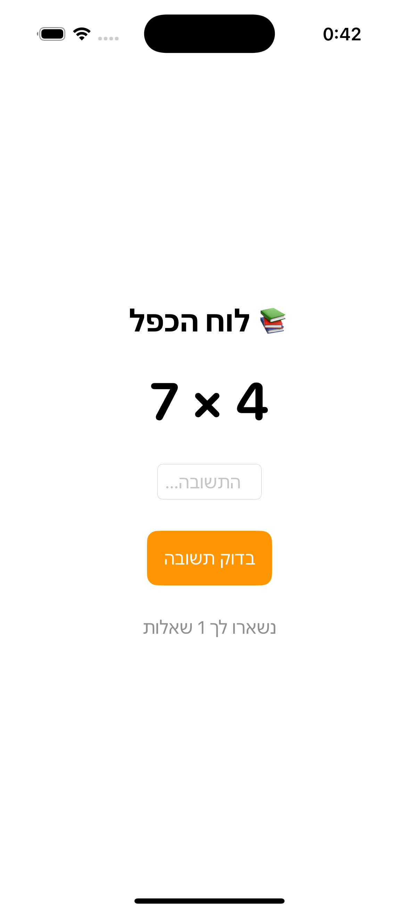
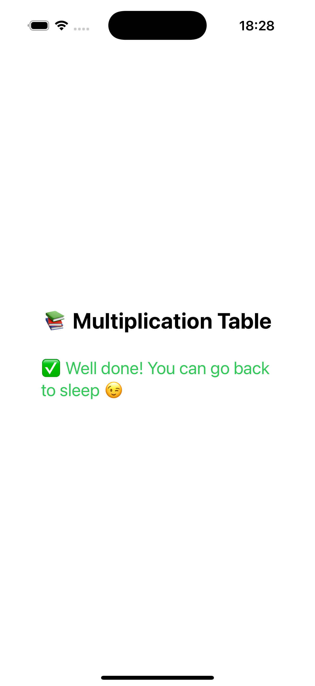

# SmartWake – Multiplication Challenge Alarm Clock

SmartWake is a smart alarm clock app built with SwiftUI that helps you wake up by solving multiplication challenges. You can't dismiss the alarm until you answer **5 questions correctly**.

---

## 🚀 Overview

This iOS app uses local notifications to trigger alarms and combines it with a simple math quiz that challenges the user to wake up and engage their brain.

---

## 🛠 Tech Stack

- **Language:** Swift
- **Framework:** SwiftUI
- **Notifications:** UserNotifications (local notifications)

---

## 🎯 Features

- ⏰ **Set Alarm** – Choose a time and receive a local notification with sound.
- ❌ **Dismiss by Solving** – Must answer **5 random multiplication** questions to stop the alarm.
- 🔄 **Cancel Alarm** – Cancel existing scheduled alarm using a single identifier.
- 🧠 **Engaging UI** – Fun design with a motivational message and colorful layout.

---

## 🧪 How It Works

1. **Select Time** – The user chooses hour & minute using a `DatePicker`.
2. **Set Alarm** – A local notification is scheduled via `UNNotificationRequest`.
3. **Alarm Triggered** – Notification appears at the selected time with sound and message.
4. **Challenge Starts** – Tapping the notification launches `MultiplyChallengeView`.
5. **Solve 5 Questions** – The app generates multiplication problems until the user solves 5 correctly.
6. **Cancel Option** – You can cancel the alarm at any time before it rings.

---

## 📲 Installation

1. Open the project in **Xcode**.
2. Run the app
3. Grant notification permissions when prompted.

---

## 📸 Screenshots

### 📩 Notification Permission Request

### ⏰ Alarm Set

### 🔔 Notification Pops Up

### 🧮 Challenge Screen

### ❓ One Question Left

### ✅ Challenge Completed

---

## 🔒 Permissions

- The app requests permission for notifications on first launch.
- Only local notifications are used (no data is sent to a server).

---

## 🙌 Author

Developed by Leroy Fainberg as part of learning Swift and SwiftUI.
